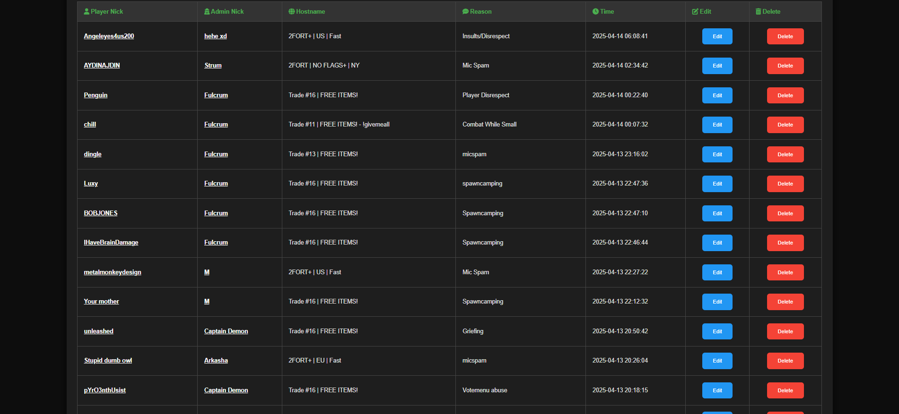

# Panel-System

## Introduction
This system was created by [tgaryt](https://ugc-gaming.net/index.php?members/ryt.3/) for [UGC-Gaming.NET](https://ugc-gaming.net). Built to help staff and employees manage tasks more efficiently while providing fast, secure access to database logs for better oversight and accountability.

## 📸 Preview

A quick look at different parts of the Panel-System:

## Requirements

- **Composer:** Version 2.7.7
- **PHP:** Version 8.3.7

## License
This project is licensed under the [MIT License](LICENSE).
